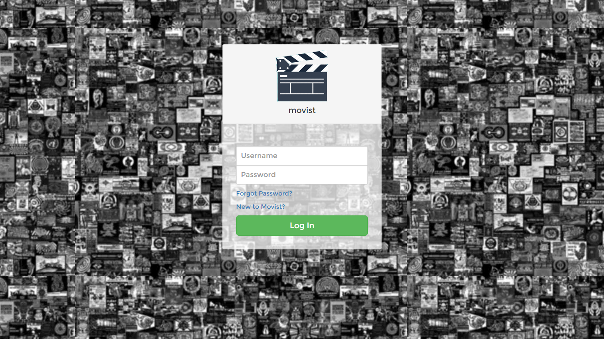
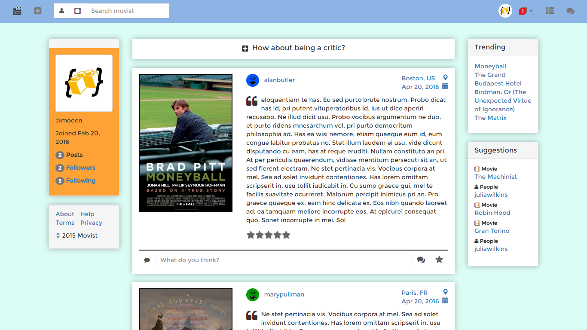
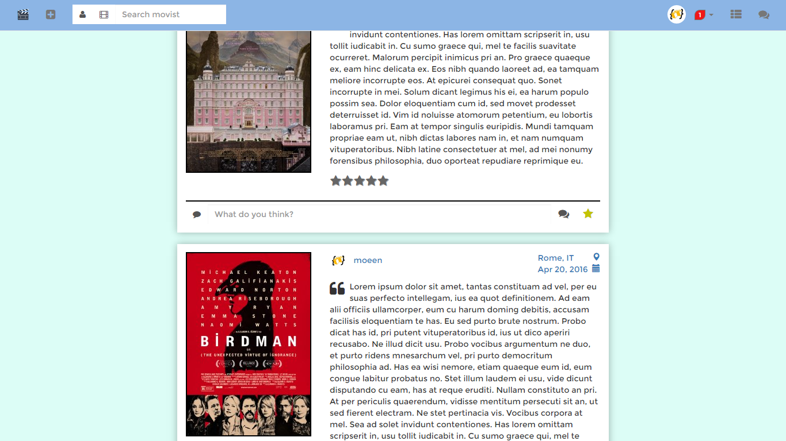
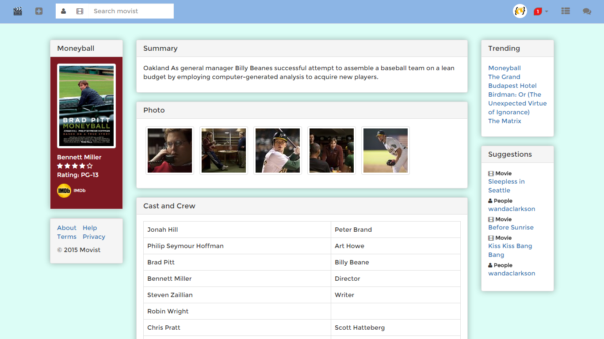
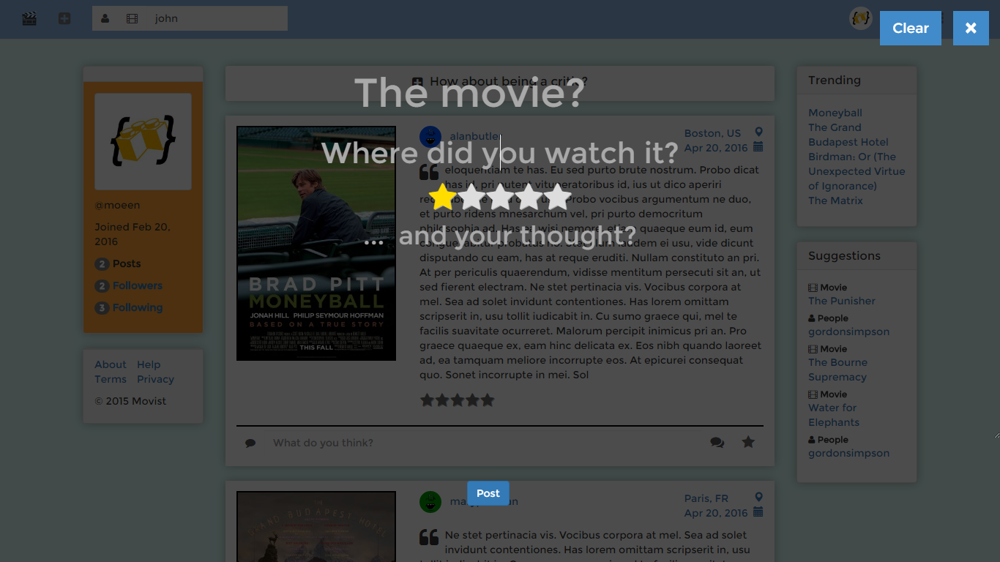
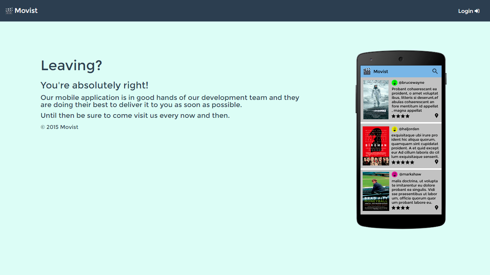

# Movist
A social network for movie enthusiasts. I did this project back in 2015 but didn't deploy it due to some reasons.

# Tech Stack
Backend was written in `Django` and `django-rest-framework` providing the required APIs. Frontend was written in `AngularJS` (1.x) and `Bootstrap`.

# Screenshots

    

	    
    

    

        
    

    

        
    

    

        
    

    

        
    

    

        
    

